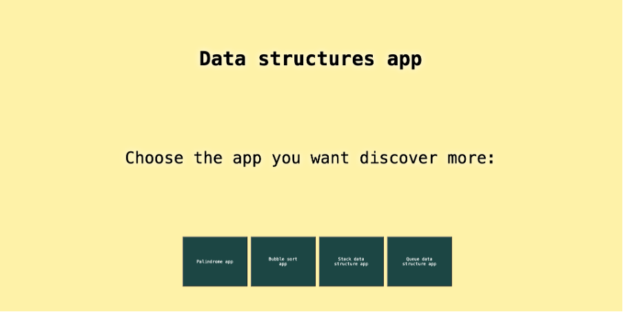
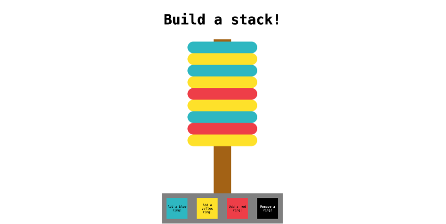
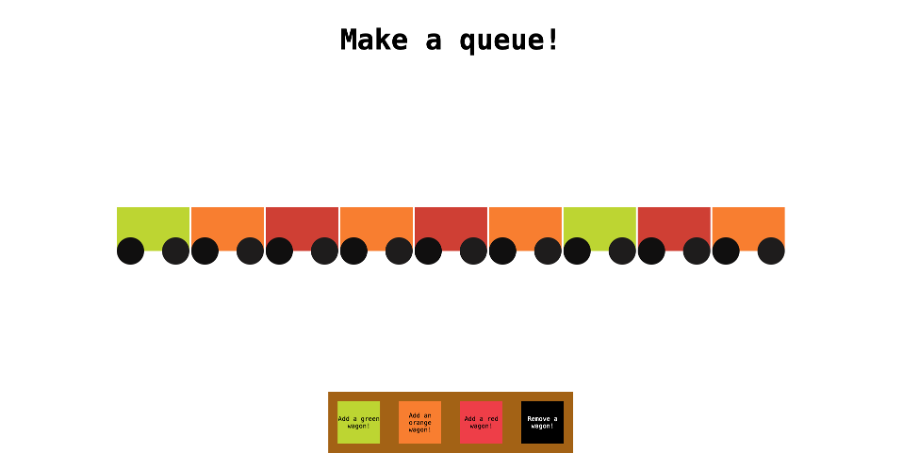

# Data structure app

Data structure app is school project done on a course called databases and data structures at Business College Helsinki in autumn term 2023. This app compiles the four projects done on the course: palindrome checker app, bubble sort app, stack data structure app and queue data structure app.

## Technologies used

- React

## Visuals

Home page

Palindrome app

Bubble sort app

Stack data structure app

Queue data structure app

